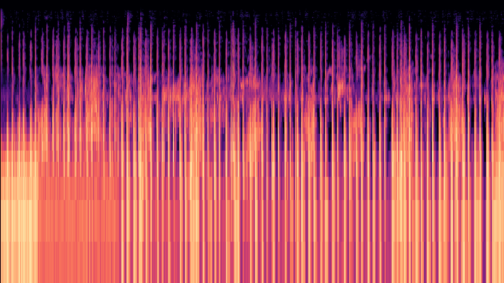

# Mel Spectrogram Generation

## Summary
The code snippet in the notebook can be used to generate a mel spectrogram from an audio file. Most audio file formats are supported. The spectrogram can also be saved in most image formats.

### Installation
No special installation steps required. Follow the virtual environment setup on
[the main repository page](../README.md#installation) and then follow the steps in the notebook.

### References
The example data is the phonocardiogram of a pregnant woman sourced from the following publication. The original file name was m42.wav.  
* Sameni, R., & Samieinasab, M. (2021). Shiraz University Fetal Heart Sounds Database (version 1.0.1). PhysioNet. https://doi.org/10.13026/42eg-8e59.

The original publication:
* M. Samieinasab and R. Sameni, Fetal phonocardiogram extraction using single channel blind source separation, 2015 23rd Iranian Conference on Electrical Engineering, Tehran, 2015, pp. 78-83. doi: 10.1109/IranianCEE.2015.7146186

PhysioNet Citation:  
* Goldberger, A., Amaral, L., Glass, L., Hausdorff, J., Ivanov, P. C., Mark, R., ... & Stanley, H. E. (2000). PhysioBank, PhysioToolkit, and PhysioNet: Components of a new research resource for complex physiologic signals. Circulation [Online]. 101 (23), pp. e215–e220.
