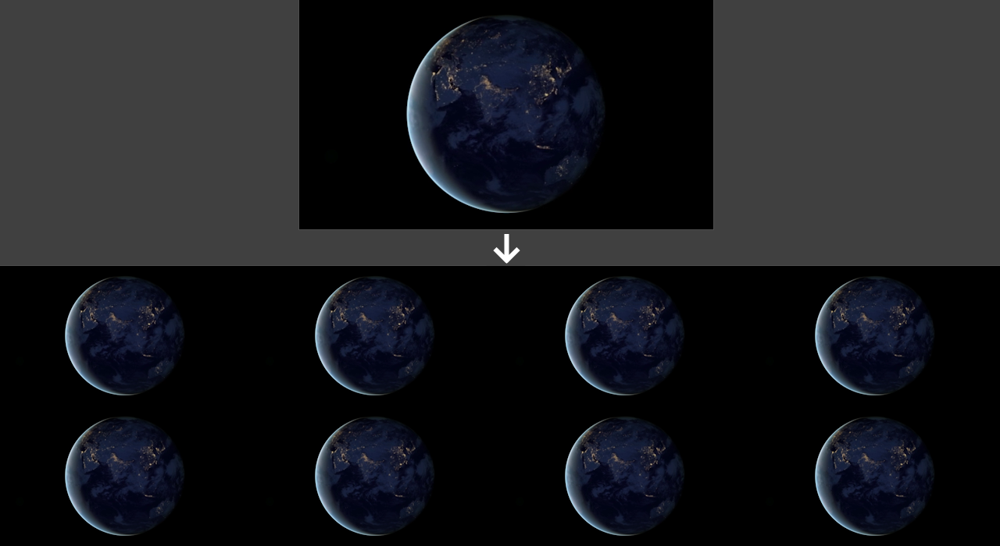

# Video to Image Conversion

## Summary
This notebook demonstrates how to convert a video to a series of images. The input video format can be any format supported by OpenCV (such as MP4 and AVI).

The output images are saved in a folder of your choosing, each image file is named with a number aligned to 3-digits (000, 001, etc) and the output can be in PNG or JPG format.

### Installation
No special installation is required, simply follow the notebook for step-by-step instructions.
